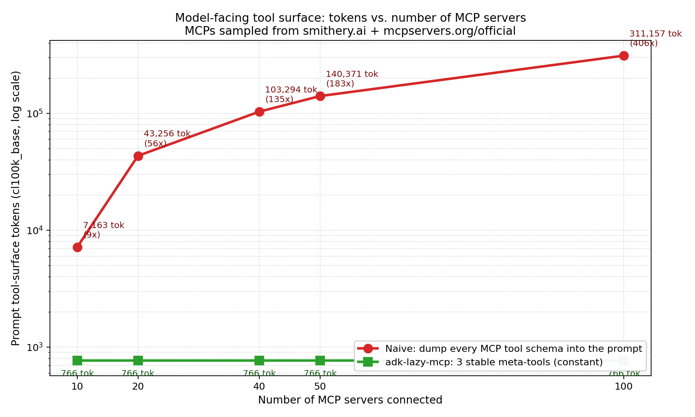
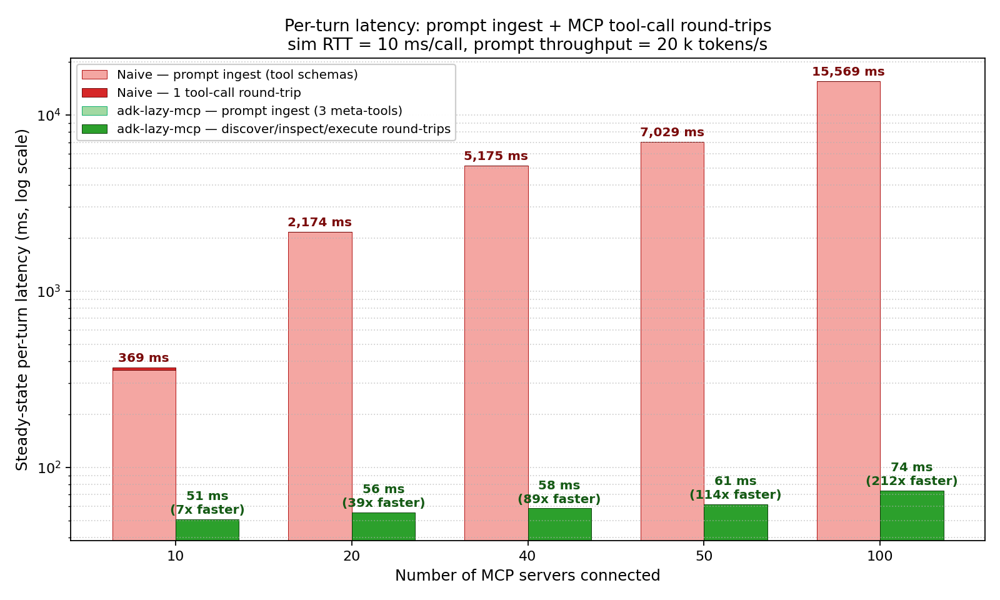
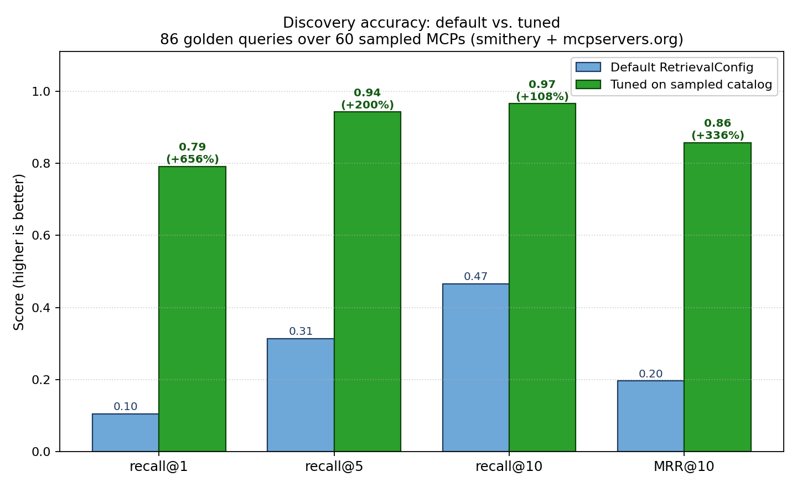

# adk-lazy-mcp

`adk-lazy-mcp` is a lazy, policy-aware MCP toolset designed for **Google ADK agents**.

Instead of exposing hundreds of raw MCP tools directly to the model, it exposes only three stable meta-tools:

1. `discover_mcp_tools`
2. `inspect_mcp_tool`
3. `execute_mcp_tool`

That keeps tool selection accurate, token usage predictable, and execution safer.

---

## The problem this library solves

When you connect many MCP servers to an LLM agent, common issues appear quickly:

- **Tool explosion**: the model sees too many tools and picks the wrong one.
- **Large prompts**: shipping every tool schema on every turn increases cost/latency.
- **Schema drift and argument mistakes**: tools fail because arguments do not match expected JSON schema.
- **Inconsistent reliability**: one flaky server can degrade end-user experience.
- **Weak guardrails**: allow/deny lists and transport policy are often ad hoc.

This is especially painful for new joiners, because they must understand ADK + MCP + several servers before they can safely ship anything.

## The solution in one paragraph

`adk-lazy-mcp` gives ADK a small and repeatable MCP workflow:

- discover only relevant tools at runtime,
- inspect one tool's schema before first execution,
- execute with client-side validation and normalized output.

Internally it adds bounded discovery, ranking, caching, per-server concurrency/timeouts, circuit-breaker style session handling, and policy checks.

---

## Benchmarks

Everything below is reproducible from [`benchmarks/`](./benchmarks/). We built a
300-server / 4,314-tool corpus by pulling every MCP we could reach from
[smithery.ai](https://smithery.ai/docs/concepts/registry_search_servers) and
[mcpservers.org/official](https://mcpservers.org/official) — see
`benchmarks/scripts/fetch_mcps.py` and `benchmarks/data/mcp_catalog.json` for
the raw catalog and attribution.

Each plot is generated directly from that catalog so you can re-run the full
suite on your own hardware:

```bash
python benchmarks/scripts/fetch_mcps.py            # ~300 MCPs, ~4.3k tools
python benchmarks/scripts/generate_golden_set.py   # 500 golden queries
python benchmarks/scripts/run_benchmark.py         # tokens + latency plots
python benchmarks/scripts/tune_discovery.py        # accuracy + parameter tuning
```

For end-to-end validation against a live model instead of the
`tokens / throughput` heuristic, `benchmarks/scripts/run_real_benchmark.py`
drives the same naive-vs-lazy comparison through `google-genai` — one call
per naive turn, three calls (`discover → inspect → execute`) per lazy turn
— and records API-reported prompt tokens + wall-clock. It needs
`GOOGLE_API_KEY` and `pip install google-genai`; see
[`benchmarks/README.md`](./benchmarks/README.md#real-world-gemini-benchmark-optional)
for the full invocation.

### 1. Model-facing tokens stay flat as the MCP pool grows



The naive integration dumps every tool schema into the prompt on every turn.
`adk-lazy-mcp` only ever exposes its three meta-tools, so the prompt-side tool
surface is constant. At 100 connected servers (1,341 tools, sampled from the
Smithery + mcpservers.org catalog):

| Pool size | Tools in prompt | Naive tokens | Lazy tokens | Reduction |
|----------:|----------------:|-------------:|------------:|----------:|
|        10 |              45 |        7,163 |         766 |    **9×** |
|        20 |             214 |       43,256 |         766 |   **56×** |
|        40 |             428 |      103,294 |         766 |  **135×** |
|        50 |             538 |      140,371 |         766 |  **183×** |
|       100 |           1,341 |      311,157 |         766 |  **406×** |

Token counts use the OpenAI `cl100k_base` tokenizer.

### 2. Steady-state per-turn latency is ~210× lower at N=100



Even with a generous prompt-processing budget of 20k tokens/sec and only 10 ms
per MCP round-trip, a naive prompt spends almost all its latency re-ingesting
tool schemas every turn. `LazyMCPToolset` pays the `discover → inspect →
execute` cost up-front once per session and is effectively constant afterwards:

| Pool size | Naive latency / turn | Lazy latency / turn | Speed-up |
|----------:|---------------------:|--------------------:|---------:|
|        10 |               369 ms |                51 ms |  **7×** |
|        20 |             2,174 ms |                56 ms | **39×** |
|        40 |             5,175 ms |                58 ms | **89×** |
|        50 |             7,029 ms |                61 ms |**114×** |
|       100 |            15,569 ms |                74 ms |**210×** |

Measured steady-state after warm-up (5 repeats per pool size) against a stub
MCP backend with a 10 ms simulated RTT, so the numbers isolate the *prompt
ingest vs. meta-tool round-trip* difference rather than network noise.

### 3. Discovery accuracy: tuning on a real catalog lifts recall@1 by ~7.5×



We generate an IDF-weighted golden query set from the catalog
(`benchmarks/scripts/generate_golden_set.py`) — one natural-language query per
tool, built from the rarest distinctive terms in its name + description — and
grade `discover_mcp_tools` on `recall@1 / recall@5 / recall@10 / MRR@10`.

Over **86 golden queries on 60 sampled MCPs**:

| Metric     | Default config | Tuned on real catalog |     Gain |
|------------|---------------:|----------------------:|---------:|
| recall@1   |           0.10 |              **0.79** | **+656%** |
| recall@5   |           0.31 |              **0.94** | **+200%** |
| recall@10  |           0.47 |              **0.97** | **+108%** |
| MRR@10     |           0.20 |              **0.86** | **+330%** |

The biggest single win came from a cross-server ranking fix: pure per-server
Reciprocal Rank Fusion gives *every* server's top match the same fused score,
so with 60+ servers the final merge was effectively alphabetical. We added a
small `global_score_weight` that lets a strong raw BM25 hit from one server
out-rank a weak hit from another server, and tuning picked a non-zero value on
the first sweep.

The full tuning grid (5 retrieval axes × `global_score_weight`) is in
`benchmarks/scripts/tune_discovery.py`. Dropping the tuned env file into your
environment reproduces the gain without any code changes:

```bash
# benchmarks/data/tuned_retrieval_config.env
export ADK_LAZY_MCP_RETRIEVAL__BM25_K1=1.2
export ADK_LAZY_MCP_RETRIEVAL__BM25_B=0.5
export ADK_LAZY_MCP_RETRIEVAL__TRIGRAM_WEIGHT=0.25
export ADK_LAZY_MCP_RETRIEVAL__NAME_TERM_WEIGHT=5
export ADK_LAZY_MCP_RETRIEVAL__SEMANTIC_RERANK_LIMIT=8
export ADK_LAZY_MCP_RETRIEVAL__GLOBAL_SCORE_WEIGHT=0.02
```

### Catalog sources

| Source | Servers fetched | Notes |
|--------|----------------:|-------|
| [smithery.ai registry](https://smithery.ai/docs/concepts/registry_search_servers) | 300 | Paginated `/servers` + per-server detail fetch for tool schemas. Requires a bearer token. |
| [mcpservers.org/official](https://mcpservers.org/official) | 12 overlapping | HTML-scraped slugs cross-referenced against Smithery qualified names for attribution. |

Raw catalog dump: [`benchmarks/data/mcp_catalog.json`](./benchmarks/data/mcp_catalog.json).
Benchmark results JSON: [`benchmarks/data/results.json`](./benchmarks/data/results.json)
and [`benchmarks/data/accuracy.json`](./benchmarks/data/accuracy.json).

---

## Architecture and workflow

### Model-facing contract (always 3 tools)

The model only ever sees:

- `discover_mcp_tools(query, server, limit)`
- `inspect_mcp_tool(server, tool, refresh)`
- `execute_mcp_tool(server, tool, arguments, timeout_ms)`

### Runtime flow

1. Your ADK agent asks `discover_mcp_tools`.
2. Agent calls `inspect_mcp_tool` for chosen tool.
3. Agent calls `execute_mcp_tool` with validated arguments.
4. Result is normalized into a stable envelope (`content`, `structured_data`, `artifact_refs`, etc.).

### Warm modes

`RegistryConfig.warm_mode` controls catalog hydration:

- `background` (default): start fast, hydrate asynchronously.
- `eager`: hydrate all servers before first use.
- `on_demand`: hydrate only when a server is first needed.

---

## Requirements

Python **3.11** or newer is required.

## Install

```bash
pip install adk-lazy-mcp
```

For local development:

```bash
pip install -e .[dev]
```

For Smithery-backed integration tests:

```bash
pip install -e .[dev,integration]
```

---

## Quick start with Google ADK

`LazyMCPToolset` is ADK-native: it follows the `BaseToolset.get_tools(readonly_context=...)` shape and returns async callables that ADK can expose to model tool-calling.

### 1) Define server config

```python
from adk_lazy_mcp import RegistryConfig, ServerConfig

servers = [
    ServerConfig(
        name="filesystem",
        transport="stdio",
        command="python",
        args=("-m", "your_mcp_server"),
        trusted=False,
        call_timeout_ms=30_000,
        allow_tools=None,
        deny_tools=("dangerous_write",),
    )
]

registry_cfg = RegistryConfig(
    warm_mode="background",
    summary_ttl_s=300,
    max_discover_results=20,
    hard_discover_cap=100,
    enable_client_validation=True,
)
```

### 2) Provide MCP adapter callbacks

You provide two async callbacks:

- `list_tools(server_name) -> list[dict]`
- `execute_tool(server_name, tool_name, arguments) -> dict`

```python
from typing import Any

async def list_tools(server: str) -> list[dict[str, Any]]:
    # bridge to your MCP client/session implementation
    ...

async def execute_tool(server: str, tool: str, arguments: dict[str, Any]) -> dict[str, Any]:
    # should return MCP CallToolResult-like payload
    # e.g. {"isError": False, "content": [...], "structuredContent": {...}}
    ...
```

### 3) Build and attach toolset

```python
from adk_lazy_mcp import LazyMCPToolset

lazy_toolset = LazyMCPToolset(
    server_configs=servers,
    registry_config=registry_cfg,
    list_tools=list_tools,
    execute_tool=execute_tool,
)

# ADK will call this and expose returned functions as model tools.
tools = await lazy_toolset.get_tools(readonly_context=None)
```

### 4) Prime the model instruction

Use the built-in instruction so the model follows the 3-step workflow:

```python
system_instruction = LazyMCPToolset.default_instruction()
```

---

## What can be configured

### 1) `ServerConfig` (per MCP server)

- `name`: logical server name used by the toolset.
- `transport`: `stdio` | `streamable_http` | `sse_legacy`.
- `command`, `args`, `env`, `cwd`: process launch fields for stdio servers.
- `url`, `headers`: endpoint/auth fields for HTTP/SSE servers.
- `trusted`: if `True`, allows retry path in session execution.
- `connect_timeout_ms`: connection timeout.
- `call_timeout_ms`: default per-tool execution timeout.
- `max_concurrency`: optional per-server concurrency override.
- `allow_tools`: optional allowlist (if set, only these tools can run).
- `deny_tools`: denylist (always blocked).
- `max_inline_bytes`: truncate oversized text payloads in normalized result.

### 2) `RegistryConfig` (global behavior)

- `warm_mode`: `background` | `eager` | `on_demand`.
- `summary_ttl_s`: tool-catalog freshness window.
- `max_discover_results`: soft cap returned to model.
- `hard_discover_cap`: hard cap safety ceiling.
- `enable_client_validation`: schema-check arguments before remote call.

`RegistryConfig()` reads environment variables via Pydantic Settings with the `ADK_LAZY_MCP_` prefix. Existing explicit constructor arguments still work and override environment values.

Examples:

```bash
export ADK_LAZY_MCP_WARM_MODE=on_demand
export ADK_LAZY_MCP_MAX_DISCOVER_RESULTS=50
export ADK_LAZY_MCP_RETRIEVAL__BM25_K1=1.8
export ADK_LAZY_MCP_RETRIEVAL__BM25_B=0.7
export ADK_LAZY_MCP_RETRIEVAL__RECIPROCAL_RANK_K=40
export ADK_LAZY_MCP_RETRIEVAL__SEMANTIC_RERANK_LIMIT=8
export ADK_LAZY_MCP_RETRIEVAL__SEMANTIC_FALLBACK_THRESHOLD=0.2
export ADK_LAZY_MCP_RETRIEVAL__SEMANTIC_NAME_FALLBACK_THRESHOLD=0.8
export ADK_LAZY_MCP_RETRIEVAL__LEADER_CLUSTER_THRESHOLD=0.4
export ADK_LAZY_MCP_RETRIEVAL__MIN_CLUSTER_TOKEN_LENGTH=4
export ADK_LAZY_MCP_RETRIEVAL__NAME_TERM_WEIGHT=4
export ADK_LAZY_MCP_RETRIEVAL__SCHEMA_PROPERTY_WEIGHT=3
export ADK_LAZY_MCP_RETRIEVAL__REQUIRED_FIELD_WEIGHT=3
export ADK_LAZY_MCP_RETRIEVAL__TRIGRAM_SIZE=4
export ADK_LAZY_MCP_RETRIEVAL__TRIGRAM_WEIGHT=0.25
export ADK_LAZY_MCP_RETRIEVAL__GLOBAL_SCORE_WEIGHT=0.02
export ADK_LAZY_MCP_RETRIEVAL__CLUSTER_STOPWORDS='["and","for","file","tool"]'
```

> **Tip:** `GLOBAL_SCORE_WEIGHT` is the single most impactful axis when you
> connect many (10+) MCP servers. See the [benchmarks section](#benchmarks) for
> why — it breaks cross-server ties that would otherwise collapse to
> alphabetical ordering.

### 3) Policy engine

You can pass a custom `PolicyEngine` to enforce:

- HTTPS-only policy for remote transports.
- host allowlist checks.
- tool allow/deny decisions.

### 4) Telemetry sink

You can pass `Telemetry` (or your own compatible sink) to track counters and execution timings.

### 5) Environment variable interpolation helper

`resolve_env_vars` resolves strings like `${API_KEY}` or `${API_KEY:-fallback}` when building server configs from env-driven templates.

---

## Result envelope shape (execute)

`execute_mcp_tool` returns a dict with these top-level keys:

- `status`: `"success"` (or an error code on failure)
- `server`: server name
- `tool`: tool name
- `duration_ms`: execution time in milliseconds
- `tool_result`: normalized result envelope containing:
  - `is_error`
  - `content` (typed content items)
  - `structured_data`
  - `artifact_refs` (for image/audio or offloaded payloads)
  - `truncated` (whether text was byte-truncated)

On failure, the top-level `status` field is set to an error code (`validation_error`, `policy_denied`, `tool_not_found`, or `execution_error`) and `tool_result` is omitted.

This keeps downstream ADK agent logic predictable across heterogeneous MCP servers.

---

## Development and checks

```bash
ruff check .             # lint
ruff format --check .    # formatting check
pytest                   # unit tests (default, skips integration)
pytest --cov=adk_lazy_mcp --cov-report=term-missing
```

### Integration tests (Smithery)

The `tests/integration/` suite exercises `LazyMCPToolset` against real
Smithery-hosted MCP servers and prints an efficiency report comparing the
three meta-tool surface to the naive "dump every MCP tool" approach. It is
gated on a `SMITHERY_API_KEY` environment variable and the `integration` extra:

```bash
pip install -e .[dev,integration]
export SMITHERY_API_KEY=...       # from https://smithery.ai/account/api-keys
pytest -m integration -s tests/integration/
```

Integration tests skip cleanly if `SMITHERY_API_KEY` or optional integration deps are missing.

---

## Why this helps new joiners

A new engineer only needs to learn one repeatable pattern:

1. Discover
2. Inspect
3. Execute

They do **not** need to manually wire every MCP tool into ADK prompts, and they get policy + validation + normalized results by default.
