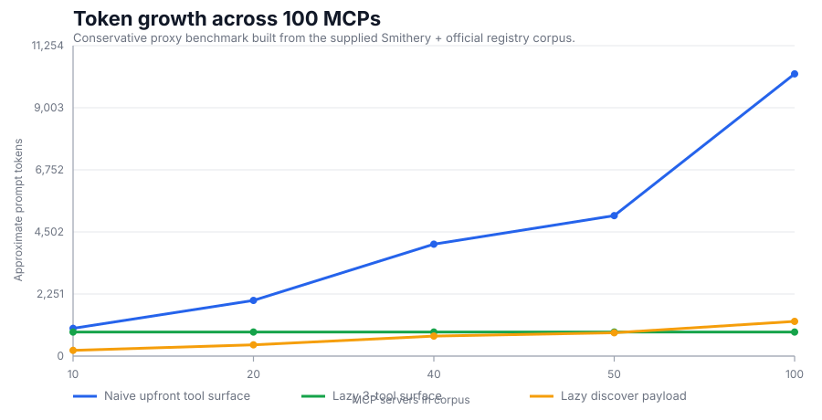
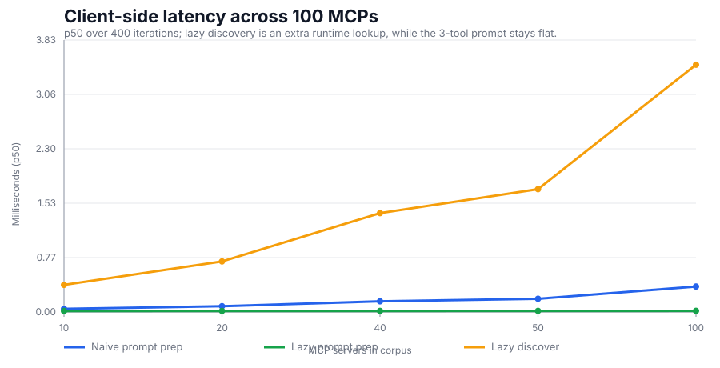

# adk-lazy-mcp

`adk-lazy-mcp` is a lazy, policy-aware MCP toolset designed for **Google ADK agents**.

Instead of exposing hundreds of raw MCP tools directly to the model, it exposes only three stable meta-tools:

1. `discover_mcp_tools`
2. `inspect_mcp_tool`
3. `execute_mcp_tool`

That keeps tool selection accurate, token usage predictable, and execution safer.

---

## The problem this library solves

When you connect many MCP servers to an LLM agent, common issues appear quickly:

- **Tool explosion**: the model sees too many tools and picks the wrong one.
- **Large prompts**: shipping every tool schema on every turn increases cost/latency.
- **Schema drift and argument mistakes**: tools fail because arguments do not match expected JSON schema.
- **Inconsistent reliability**: one flaky server can degrade end-user experience.
- **Weak guardrails**: allow/deny lists and transport policy are often ad hoc.

This is especially painful for new joiners, because they must understand ADK + MCP + several servers before they can safely ship anything.

## The solution in one paragraph

`adk-lazy-mcp` gives ADK a small and repeatable MCP workflow:

- discover only relevant tools at runtime,
- inspect one tool's schema before first execution,
- execute with client-side validation and normalized output.

Internally it adds bounded discovery, ranking, caching, per-server concurrency/timeouts, circuit-breaker style session handling, and policy checks.

---

## Architecture and workflow

### Model-facing contract (always 3 tools)

The model only ever sees:

- `discover_mcp_tools(query, server, limit)`
- `inspect_mcp_tool(server, tool, refresh)`
- `execute_mcp_tool(server, tool, arguments, timeout_ms)`

### Runtime flow

1. Your ADK agent asks `discover_mcp_tools`.
2. Agent calls `inspect_mcp_tool` for chosen tool.
3. Agent calls `execute_mcp_tool` with validated arguments.
4. Result is normalized into a stable envelope (`content`, `structured_data`, `artifact_refs`, etc.).

### Warm modes

`RegistryConfig.warm_mode` controls catalog hydration:

- `background` (default): start fast, hydrate asynchronously.
- `eager`: hydrate all servers before first use.
- `on_demand`: hydrate only when a server is first needed.

---

## Requirements

Python **3.11** or newer is required.

## Install

```bash
pip install adk-lazy-mcp
```

For local development:

```bash
pip install -e .[dev]
```

For Smithery-backed integration tests:

```bash
pip install -e .[dev,integration]
```

---

## Quick start with Google ADK

`LazyMCPToolset` is ADK-native: it follows the `BaseToolset.get_tools(readonly_context=...)` shape and returns async callables that ADK can expose to model tool-calling.

### 1) Define server config

```python
from adk_lazy_mcp import RegistryConfig, ServerConfig

servers = [
    ServerConfig(
        name="filesystem",
        transport="stdio",
        command="python",
        args=("-m", "your_mcp_server"),
        trusted=False,
        call_timeout_ms=30_000,
        allow_tools=None,
        deny_tools=("dangerous_write",),
    )
]

registry_cfg = RegistryConfig(
    warm_mode="background",
    summary_ttl_s=300,
    max_discover_results=20,
    hard_discover_cap=100,
    enable_client_validation=True,
)
```

### 2) Provide MCP adapter callbacks

You provide two async callbacks:

- `list_tools(server_name) -> list[dict]`
- `execute_tool(server_name, tool_name, arguments) -> dict`

```python
from typing import Any

async def list_tools(server: str) -> list[dict[str, Any]]:
    # bridge to your MCP client/session implementation
    ...

async def execute_tool(server: str, tool: str, arguments: dict[str, Any]) -> dict[str, Any]:
    # should return MCP CallToolResult-like payload
    # e.g. {"isError": False, "content": [...], "structuredContent": {...}}
    ...
```

### 3) Build and attach toolset

```python
from adk_lazy_mcp import LazyMCPToolset

lazy_toolset = LazyMCPToolset(
    server_configs=servers,
    registry_config=registry_cfg,
    list_tools=list_tools,
    execute_tool=execute_tool,
)

# ADK will call this and expose returned functions as model tools.
tools = await lazy_toolset.get_tools(readonly_context=None)
```

### 4) Prime the model instruction

Use the built-in instruction so the model follows the 3-step workflow:

```python
system_instruction = LazyMCPToolset.default_instruction()
```

---

## What can be configured

### 1) `ServerConfig` (per MCP server)

- `name`: logical server name used by the toolset.
- `transport`: `stdio` | `streamable_http` | `sse_legacy`.
- `command`, `args`, `env`, `cwd`: process launch fields for stdio servers.
- `url`, `headers`: endpoint/auth fields for HTTP/SSE servers.
- `trusted`: if `True`, allows retry path in session execution.
- `connect_timeout_ms`: connection timeout.
- `call_timeout_ms`: default per-tool execution timeout.
- `max_concurrency`: optional per-server concurrency override.
- `allow_tools`: optional allowlist (if set, only these tools can run).
- `deny_tools`: denylist (always blocked).
- `max_inline_bytes`: truncate oversized text payloads in normalized result.

### 2) `RegistryConfig` (global behavior)

- `warm_mode`: `background` | `eager` | `on_demand`.
- `summary_ttl_s`: tool-catalog freshness window.
- `max_discover_results`: soft cap returned to model.
- `hard_discover_cap`: hard cap safety ceiling.
- `enable_client_validation`: schema-check arguments before remote call.

`RegistryConfig()` reads environment variables via Pydantic Settings with the `ADK_LAZY_MCP_` prefix. Existing explicit constructor arguments still work and override environment values.

Examples:

```bash
export ADK_LAZY_MCP_WARM_MODE=on_demand
export ADK_LAZY_MCP_MAX_DISCOVER_RESULTS=50
export ADK_LAZY_MCP_RETRIEVAL__BM25_K1=1.8
export ADK_LAZY_MCP_RETRIEVAL__BM25_B=0.7
export ADK_LAZY_MCP_RETRIEVAL__RECIPROCAL_RANK_K=40
export ADK_LAZY_MCP_RETRIEVAL__SEMANTIC_RERANK_LIMIT=8
export ADK_LAZY_MCP_RETRIEVAL__SEMANTIC_FALLBACK_THRESHOLD=0.2
export ADK_LAZY_MCP_RETRIEVAL__SEMANTIC_NAME_FALLBACK_THRESHOLD=0.8
export ADK_LAZY_MCP_RETRIEVAL__LEADER_CLUSTER_THRESHOLD=0.4
export ADK_LAZY_MCP_RETRIEVAL__MIN_CLUSTER_TOKEN_LENGTH=4
export ADK_LAZY_MCP_RETRIEVAL__NAME_TERM_WEIGHT=4
export ADK_LAZY_MCP_RETRIEVAL__SCHEMA_PROPERTY_WEIGHT=3
export ADK_LAZY_MCP_RETRIEVAL__REQUIRED_FIELD_WEIGHT=3
export ADK_LAZY_MCP_RETRIEVAL__TRIGRAM_SIZE=4
export ADK_LAZY_MCP_RETRIEVAL__TRIGRAM_WEIGHT=0.25
export ADK_LAZY_MCP_RETRIEVAL__CLUSTER_STOPWORDS='["and","for","file","tool"]'
```

### 3) Policy engine

You can pass a custom `PolicyEngine` to enforce:

- HTTPS-only policy for remote transports.
- host allowlist checks.
- tool allow/deny decisions.

### 4) Telemetry sink

You can pass `Telemetry` (or your own compatible sink) to track counters and execution timings.

### 5) Environment variable interpolation helper

`resolve_env_vars` resolves strings like `${API_KEY}` or `${API_KEY:-fallback}` when building server configs from env-driven templates.

---

## Result envelope shape (execute)

`execute_mcp_tool` returns a dict with these top-level keys:

- `status`: `"success"` (or an error code on failure)
- `server`: server name
- `tool`: tool name
- `duration_ms`: execution time in milliseconds
- `tool_result`: normalized result envelope containing:
  - `is_error`
  - `content` (typed content items)
  - `structured_data`
  - `artifact_refs` (for image/audio or offloaded payloads)
  - `truncated` (whether text was byte-truncated)

On failure, the top-level `status` field is set to an error code (`validation_error`, `policy_denied`, `tool_not_found`, or `execution_error`) and `tool_result` is omitted.

This keeps downstream ADK agent logic predictable across heterogeneous MCP servers.

---

## Development and checks

```bash
ruff check .             # lint
ruff format --check .    # formatting check
pytest                   # unit tests (default, skips integration)
pytest --cov=adk_lazy_mcp --cov-report=term-missing
```

### Integration tests (Smithery)

The `tests/integration/` suite exercises `LazyMCPToolset` against real
Smithery-hosted MCP servers and prints an efficiency report comparing the
three meta-tool surface to the naive "dump every MCP tool" approach. It is
gated on a `SMITHERY_API_KEY` environment variable and the `integration` extra:

```bash
pip install -e .[dev,integration]
export SMITHERY_API_KEY=...       # from https://smithery.ai/account/api-keys
pytest -m integration -s tests/integration/
```

Integration tests skip cleanly if `SMITHERY_API_KEY` or optional integration deps are missing.

---

## Registry-scale benchmark (100 MCPs)

The repository also includes a reproducible **100-MCP registry-scale benchmark**
for the exact growth points requested here: **10, 20, 40, 50, and 100 MCPs**.

- Corpus: `docs/benchmarks/registry_corpus.json`
- Generator: `scripts/generate_registry_scale_benchmarks.py`
- Outputs: `docs/benchmarks/registry_scale_results.json` + the SVG plots below

The corpus is the supplied mixed **Smithery + official/verified** manifest:

- `100` total MCP entries
- `22` verified entries
- `78` community entries

Representative entries include `Math-MCP`, `Gmail`, `GitHub`, `Browserbase`,
`Google Sheets`, `Notion`, `US Weather`, and `Context7`. The full committed
corpus keeps the original `name`, `url`, `desc`, `verified`, and `uses` fields
so reviewers can see exactly where each benchmarked MCP entry came from.

### Methodology

- For each level (`10`, `20`, `40`, `50`, `100`), we take the top-`N` MCPs by
  the provided `uses` count.
- Each registry entry is normalized into **one conservative proxy tool** built
  from its public name and description.
- Token counts use the same rough **4 chars ≈ 1 token** heuristic as
  `tests/integration/test_efficiency.py`.
- Latency is **client-side p50** over `400` iterations.
- This is intentionally conservative: many real MCPs expose **multiple tools**
  and much larger schemas, so the naive prompt-size line below is a **lower
  bound**.

### Token growth



### Client-side latency



### What the plots show

- At **100 MCPs**, the naive upfront tool dump reaches **10,231 tokens**.
- The lazy model-facing contract stays flat at **872 tokens** (**11.7x
  smaller**).
- Even the first lazy discovery payload is only **1,258 tokens**, because
  discovery stays bounded instead of shipping every MCP upfront.
- Prompt preparation for the fixed 3-tool lazy surface stayed flat at about
  **0.016 ms p50** across the whole corpus.
- `discover_mcp_tools()` on the 100-MCP corpus stayed at **3.48 ms p50**.

| MCPs | Naive upfront tokens | Lazy 3-tool tokens | Lazy discover tokens | Naive / lazy | Naive prep p50 | Lazy prep p50 | Lazy discover p50 |
|---|---:|---:|---:|---:|---:|---:|---:|
| 10 | 1,006 | 872 | 208 | 1.2x | 0.044 ms | 0.014 ms | 0.382 ms |
| 20 | 2,018 | 872 | 408 | 2.3x | 0.081 ms | 0.015 ms | 0.712 ms |
| 40 | 4,057 | 872 | 725 | 4.7x | 0.151 ms | 0.015 ms | 1.391 ms |
| 50 | 5,092 | 872 | 846 | 5.8x | 0.186 ms | 0.015 ms | 1.728 ms |
| 100 | 10,231 | 872 | 1,258 | 11.7x | 0.358 ms | 0.016 ms | 3.478 ms |

To regenerate the corpus benchmark:

```bash
python scripts/generate_registry_scale_benchmarks.py
```

For live Smithery tool-schema checks against real MCP servers, keep using the
integration suite above. The registry-scale benchmark here is the broader
**100-MCP growth view** for the README.

---

## Why this helps new joiners

A new engineer only needs to learn one repeatable pattern:

1. Discover
2. Inspect
3. Execute

They do **not** need to manually wire every MCP tool into ADK prompts, and they get policy + validation + normalized results by default.
